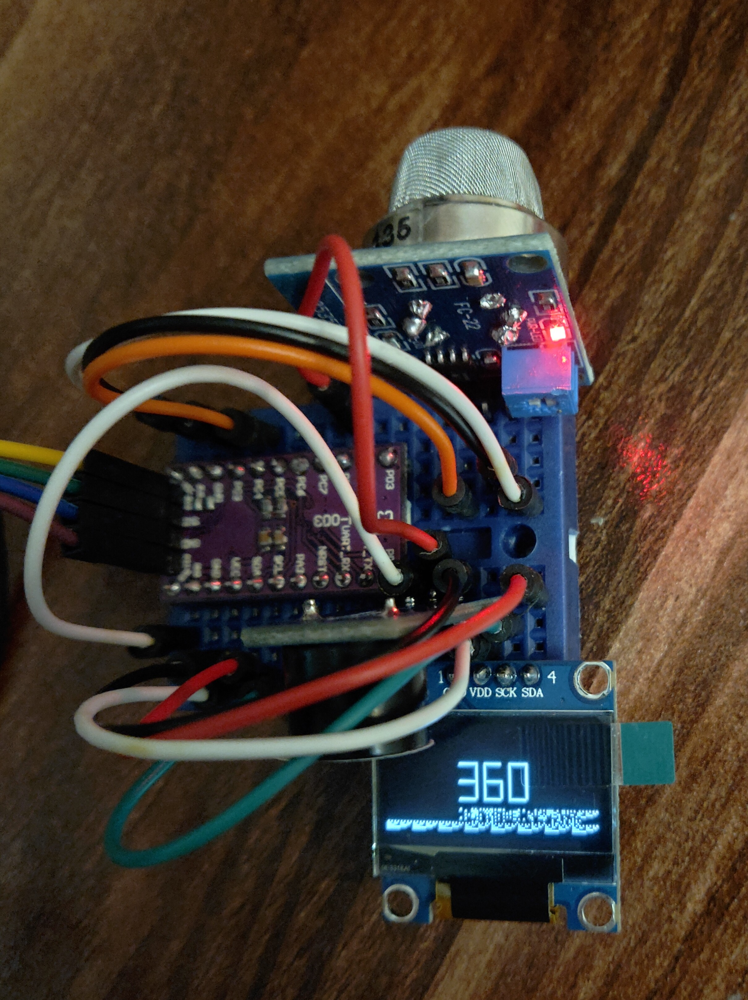

# Air Quality Logger (STM8)
This project displays Air Quality (sensitive to CO2, Alcohol, etc.) in PPM and alarms when it exceeds 400 PPM.

It consists of the microcontroller `stm8s003f3p6`, `Sduino` in `PlatformIO`, `MQ135`, `OLED Display` and a buzzer.

